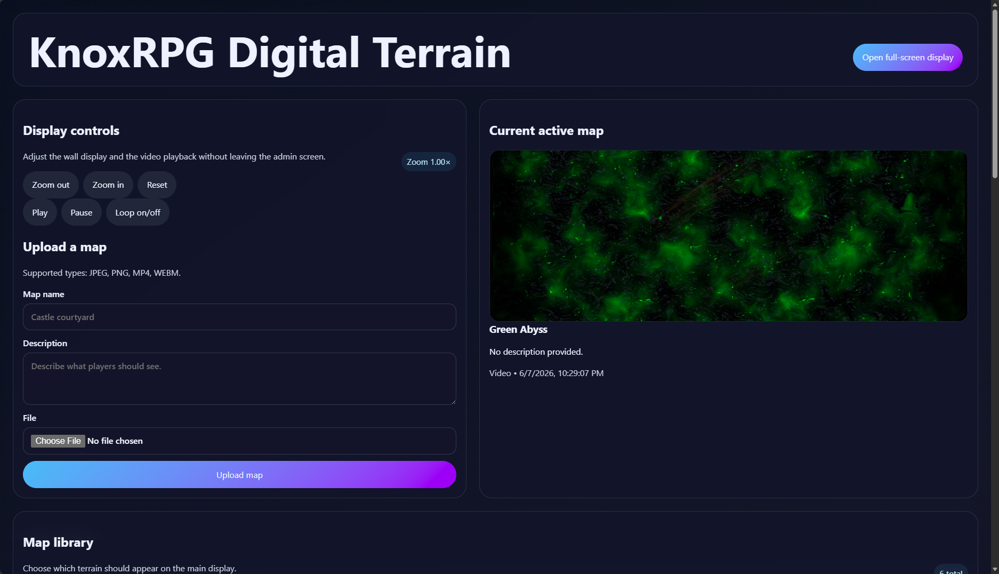
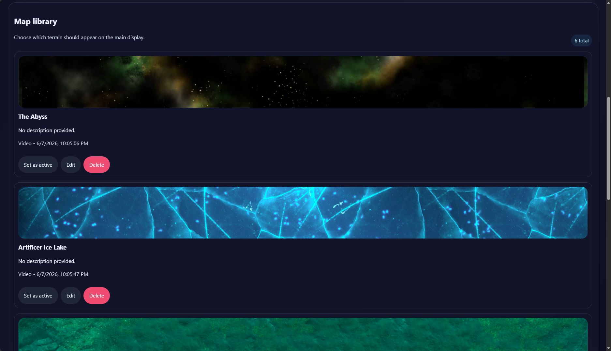

# KnoxRPG Digital Terrain

A lightweight digital map display for tabletop RPG game tables. Built to run on a Raspberry Pi connected to a TV or monitor mounted under (or on) your table.

Most VTT software is overkill when all you need is a way to throw a map on a screen. This does exactly that -- serves images and videos to a fullscreen kiosk display, controlled from any browser on the same network.

## What It Does

- Displays JPEG, PNG, MP4, or WEBM maps fullscreen on the connected display with no visible UI chrome or cursor.
- Provides a web-based admin panel (accessible from a phone, laptop, or any device on the same network) to upload, name, delete, and swap maps on the fly.
- Supports zoom in/out on the active map.
- Video maps support play, pause, and loop controls from the admin panel.
- All map files are stored locally on the Pi's SD card.

## Screenshots

**Admin Panel -- Map Controls**



**Map Library**



## Requirements

- Raspberry Pi (2GB+ RAM) running Raspberry Pi OS
- HDMI display (TV, monitor, or game table screen)
- Node.js 18+

## Quick Start

### Raspberry Pi

Clone the repo onto your Pi, then run the setup script once:

```sh
git clone https://github.com/BenTheCloudGuy/knoxrpg-digital-terrain.git
cd knoxrpg-digital-terrain
sudo bash scripts/setup.sh
sudo reboot
```

This handles everything: Node.js, Chromium, npm dependencies, the React client build, a udev rule to hide the cursor on the kiosk display, and two systemd services (`knoxrpg-digital-terrain` for the API server, `knoxrpg-digital-terrain-display` for the fullscreen Chromium kiosk). Re-running the script is safe.

After reboot the display shows the active map fullscreen, and the admin panel is available at `http://<pi-ip>:3001`.

### Updating

After pulling new changes:

```sh
cd knoxrpg-digital-terrain
git pull
sudo bash scripts/restart.sh
```

This refreshes dependencies, rebuilds the client, self-heals any missing OS-level config, and restarts both services. Uploaded maps are preserved.

### Local Development

```sh
npm install
cd client && npm install && cd ..
npm run dev
```

Runs the Express API on port 3001 and the Vite dev server for the React client. The admin panel will be at `http://localhost:5173` and the display page at `http://localhost:3001/display.html`.

## Architecture

```
server/index.js        Express API -- map CRUD, file uploads, display state
client/src/App.jsx     React admin panel
client/public/display.html   Fullscreen kiosk display page (polls server for state)
scripts/setup.sh       One-time Pi provisioning
scripts/restart.sh     Post-update service refresh
scripts/start_display.sh     Launched by the display systemd unit
uploads/               Map media files (gitignored)
data/                  Runtime state -- maps.json, display-state.json (gitignored)
```


